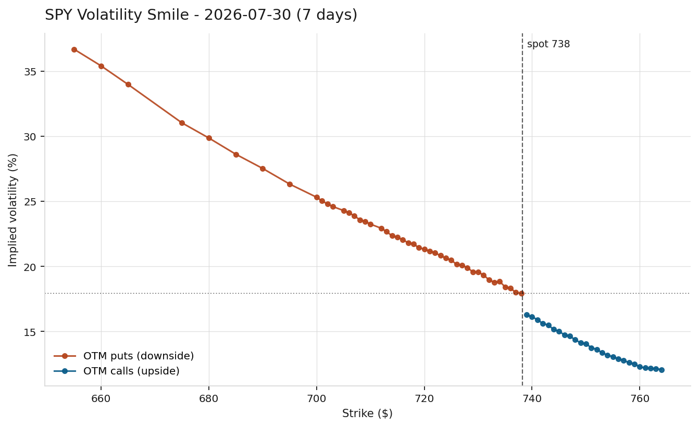
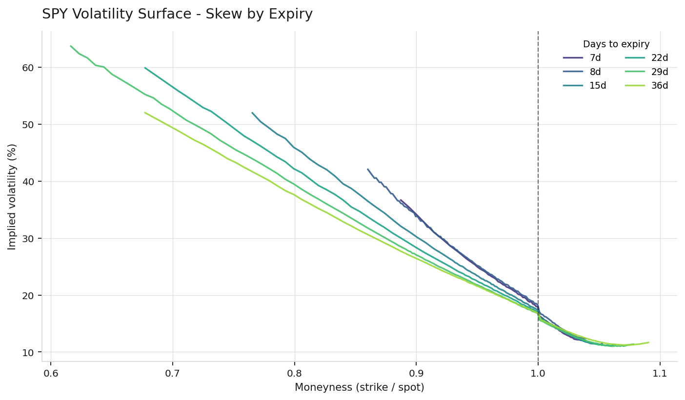
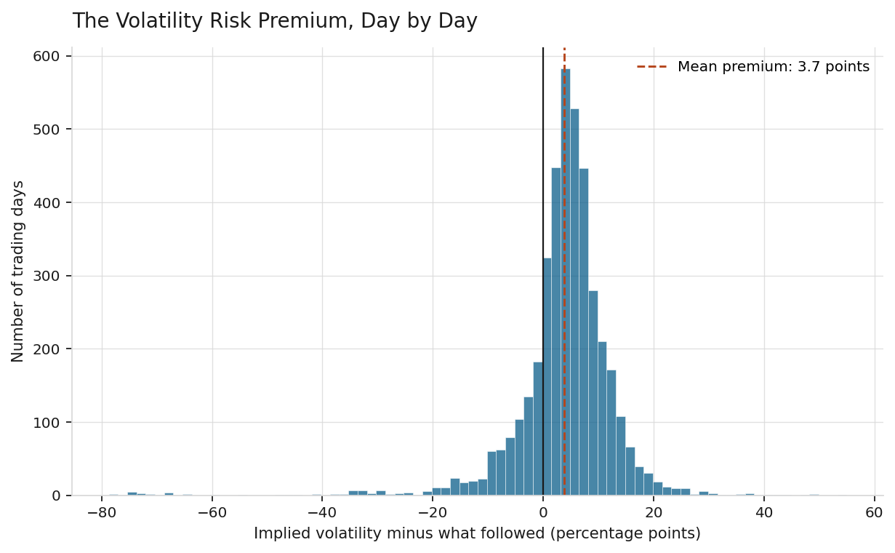
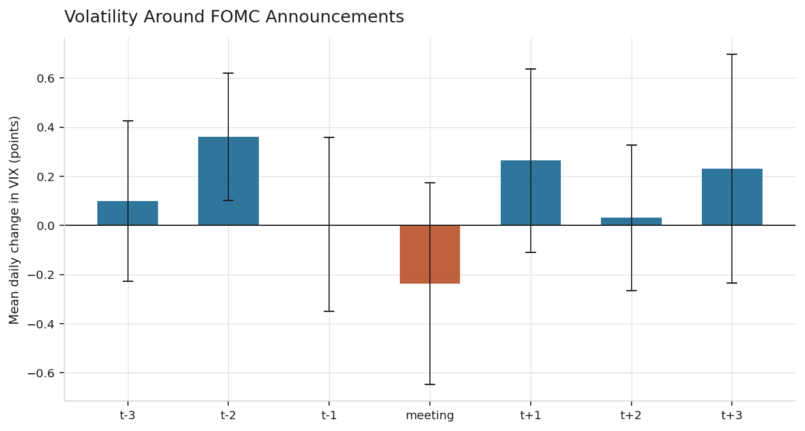
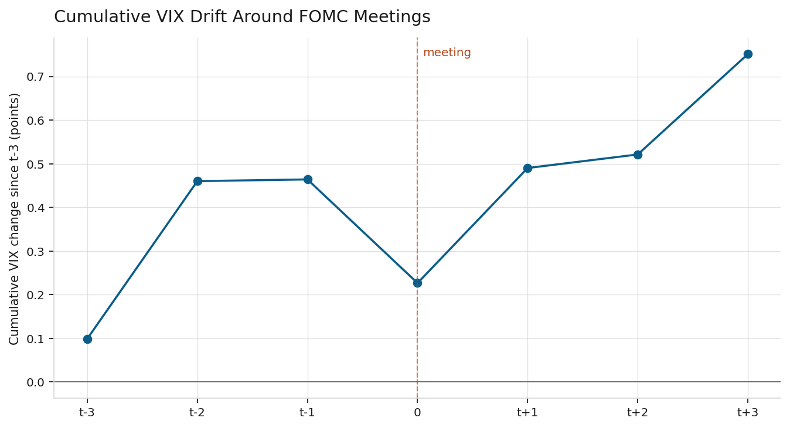

# A Replication Study of Implied Volatility, the Volatility Risk Premium, and the Pre-FOMC Drift in S&P 500 Options

**Jack Cooper Warrington**
Student at the University of Denver

*Methods: Black-Scholes pricing, implied volatility inversion, OLS regression, event study, forecast evaluation*

*Data & tools: Python, SciPy, statsmodels, VIX, SPY options chains, Federal Reserve meeting calendar*

*Repository: [github.com/JackCooperWarrington/sp500-implied-volatility](https://github.com/JackCooperWarrington/sp500-implied-volatility)*

---

## Abstract

This paper is a replication study of three well-established results in the empirical options and asset pricing literature, using publicly available data and standard econometric methods. First, using live SPY option chain data, I price contracts with the Black-Scholes model and invert the formula to extract implied volatility for every liquid strike, reproducing the well-documented volatility skew that Black-Scholes cannot generate. Second, using sixteen years of daily VIX and SPY data, I test whether the market's implied volatility forecast is an unbiased predictor of the volatility that actually follows, and reproduce the volatility risk premium documented in Carr and Wu (2009) and Bollerslev et al. (2009). The mean premium in the sample is +3.75 volatility points with a t-statistic of 24.8. Third, motivated by the theory of monetary policy uncertainty in Lucca and Moench (2015), I conduct an event study around 132 Federal Open Market Committee (FOMC) announcements and reproduce a statistically significant pre-meeting rise in VIX two trading days before each announcement (t-statistic of 2.73, p < 0.01). A subsample analysis reveals that all three findings are broadly stable across pre-2020 and post-2020 subsamples in terms of magnitude, but the forecast quality of implied volatility and the statistical precision of the pre-FOMC rise have both weakened noticeably in the more recent period. Complete reproducible Python code, pinned dependency versions, and full model output are provided in the repository.

---

## 1. Introduction

Options are financial contracts that come in two basic types, and each type has two sides to the trade. A call option gives its buyer the right, but not the obligation, to buy an underlying asset at a specified price on a specified future date. A put option gives its buyer the right, but not the obligation, to sell an underlying asset at a specified price on a specified future date. On the other side of every option is a seller, often called the writer, who receives payment upfront in exchange for the obligation to fulfill the contract if the buyer chooses to exercise it: the seller of a call must sell the asset if called upon to do so, and the seller of a put must buy the asset if called upon to do so. So a single option, whether a call or a put, always has a buyer holding a right and a seller holding an obligation, and market participants routinely take either side of either type, buying calls, selling calls, buying puts, or selling puts, depending on what view they hold and what risk they are willing to accept. Because the value of an option depends on how much the underlying asset might move before it expires, options are inherently a market for volatility. The Black-Scholes model (Black and Scholes, 1973) provides the standard theoretical framework for pricing options and takes five inputs: the current price of the underlying asset, called spot; the price at which the option can be exercised, called strike; the time remaining until expiration; the risk-free interest rate; and volatility. Four of these inputs are observable at any moment. Volatility, however, describes the future path of the asset and cannot be observed directly.

This creates an inversion that has become central to how the derivatives industry actually operates. Rather than plug a volatility assumption into Black-Scholes to obtain a theoretical price, market participants observe the actual traded price of an option and solve backward for the volatility that would make the model reproduce that price. The resulting number is called implied volatility, and can be understood as the market's collective forecast of future volatility, extracted from the price market participants are willing to pay today.

This paper is a replication study rather than novel research. Each of the three phenomena documented here (the volatility skew, the volatility risk premium, and the pre-FOMC drift) has been established in the finance literature for years, and specialists in this area are not going to learn anything new from the results. The contribution of the paper is instead threefold. First, it demonstrates that these findings, though produced originally with proprietary datasets and sophisticated methods, can be reliably reproduced using only free public data and standard econometric tools. Second, it provides a self-contained treatment that ties the empirical patterns explicitly to their theoretical motivation, connecting the volatility risk premium to the microeconomic theory of risk pricing and connecting the pre-FOMC drift to the rational expectations theory of scheduled information events. Third, by presenting robustness checks split at 2020, it documents a real feature of the recent sample: the volatility risk premium is stable in magnitude across the pre-COVID and post-COVID subsamples, but the forecast quality of implied volatility, and the statistical precision of the pre-FOMC drift, have both deteriorated in the more recent period.

The paper is organized as follows. Section 2 lays out the theoretical background from options pricing, asset pricing, and macro-finance. Section 3 describes the data sources. Section 4 describes the methodology, including the numerical solver for implied volatility and the regression specifications. Section 5 reports the results in four subsections corresponding to the three research questions plus the robustness analysis. Section 6 discusses the results in context. Section 7 addresses limitations, including a direct discussion of the ordinary least squares standard error assumption and why more advanced corrections are left for future work. Section 8 concludes. All references are collected in a bibliography, and appendices document the reproducibility of the analysis.

## 2. Background and theoretical framework

### 2.1 The Black-Scholes model and implied volatility

Black and Scholes (1973) derived a closed-form solution for the price of a European-style option under a set of simplifying assumptions, most importantly that the underlying asset's continuously compounded returns follow a Gaussian random walk with constant volatility. Under these assumptions, the price of a European call option is:

*C = S · N(d₁) − K · exp(−rT) · N(d₂)*

where S is the spot price of the underlying, K is the strike price, T is the time to expiration in years, r is the risk-free interest rate, N(·) is the standard normal cumulative distribution function, and the intermediate quantities d₁ and d₂ are functions of these inputs and the volatility parameter σ:

*d₁ = [ln(S/K) + (r + σ²/2) · T] / (σ · √T)*
*d₂ = d₁ − σ · √T*

A central prediction of the Black-Scholes model is that a single value of σ should govern the price of all options written on the same underlying asset, regardless of strike or expiration. Empirically, this prediction is systematically violated. When implied volatilities are computed for a set of options at different strikes and plotted against the strike price, they do not lie on a horizontal line. For equity index options in particular, they trace out an asymmetric curve where implied volatility is much higher for options struck below the current price than for options struck above it. This pattern is called the volatility skew (see Rubinstein 1994 for the original documentation of this pattern in S&P 500 options following the 1987 crash).

### 2.2 The volatility risk premium

A large body of empirical work, summarized in Carr and Wu (2009) and Bollerslev et al. (2009), documents that implied volatility on aggregate equity indices systematically exceeds the volatility that subsequently realizes. This gap is not treated as a market forecasting error, but rather as compensation for a specific form of risk. The economic reasoning connects to the microeconomic theory of risk-averse pricing. Consider a market participant who systematically writes (that is, sells) both calls and puts on the S&P 500 and hedges the resulting exposure. On most days this strategy earns small profits, but occasionally it suffers large losses when the market makes an abrupt move, since the writer of a put must buy the index if it falls, and the writer of a call must sell the index if it rises. Under standard assumptions about risk aversion, such a participant will only take on that exposure if paid, on average, more than the exposure will end up costing.

The parallel to insurance is direct. An insurance company charges premiums that exceed expected claims to compensate its shareholders for bearing the variance in claims. Similarly, a market maker who is systematically a net writer of calls and puts must be compensated for bearing the variance in realized volatility that comes with those positions. The gap between implied and realized volatility is that compensation, and it is called the volatility risk premium.

### 2.3 Monetary policy uncertainty and the pre-FOMC drift

The Federal Open Market Committee (FOMC) is the arm of the Federal Reserve that sets U.S. monetary policy. It holds eight regularly scheduled meetings per year, and releases its interest rate decision at 2:00 PM Eastern Time on the second day of each meeting. Because the timing and topic of these announcements are known well in advance, the rational expectations framework predicts that any policy-related uncertainty should be reflected in asset prices before the announcement, and should decline once the announcement resolves the ambiguity.

Lucca and Moench (2015) documented a striking pattern in equity index returns in the 24 hours before FOMC announcements. Separately, a body of work focused specifically on implied volatility, including Nikkinen and Sahlström (2004), finds that the implied volatility of a broad equity index rises in the days before scheduled FOMC meetings and falls afterward, once the announcement resolves the uncertainty. This pattern, sometimes described as a pre-FOMC drift in volatility rather than in returns, provides a natural test of the rational expectations theory of scheduled information events, and offers a link between the aggregate volatility risk premium documented in Section 2.2 and specific identifiable macroeconomic sources of risk.

## 3. Data

Two data sources are used, both publicly available at no cost.

Live option chain data is sourced from Yahoo Finance via the yfinance Python library. For the analysis in Section 5.1, the option chain for SPDR S&P 500 ETF Trust (ticker SPY) is collected on a single trading day, comprising 1,463 contracts across six expiration dates. After applying the quality filters described in Section 4.1, 1,227 contracts remain.

Historical VIX and SPY data is also sourced from Yahoo Finance and covers the period January 4, 2010 through July 23, 2026, comprising 4,164 trading days. The VIX (Chicago Board Options Exchange Volatility Index) is a widely used measure of 30-day implied volatility for the S&P 500 index, calculated by the CBOE using a methodology equivalent in principle to the paper's own implied volatility solver but aggregated across many strikes rather than reported strike by strike. VIX serves as a long-history stand-in for SPY's own implied volatility because free option chain data provides only a current snapshot rather than a time series.

FOMC announcement dates are compiled from the Federal Reserve's public historical meeting calendar (federalreserve.gov), yielding 132 decisions in the sample period. This count includes three inter-meeting emergency decisions during the March 2020 COVID-19 policy response, when the FOMC cut rates outside of its regular schedule to address market disruption.

## 4. Methodology

### 4.1 Implied volatility solver

Implied volatility is extracted from each option's observed market price by solving for the value of σ that makes the Black-Scholes formula reproduce the observed price. Because there is no closed-form inversion of the Black-Scholes formula for σ, the solution is found numerically using Brent's method (Brent, 1973), a standard root-finding algorithm that brackets the solution between two bounds and narrows in on it through successive interpolation.

Brent's method is chosen over the Newton-Raphson method commonly taught in textbooks because Newton-Raphson requires dividing by the option's sensitivity to volatility (a quantity called vega), and vega collapses toward zero for deep out-of-the-money options. At exactly the strikes that carry the most information about the shape of the volatility skew, Newton-Raphson can become numerically unstable or fail to converge, while Brent's method cannot diverge as long as the solution lies within the initial brackets.

Three data quality filters are applied before computing implied volatility. First, only contracts with two-sided bid/ask quotes and open interest above ten contracts are retained, ensuring active markets. Second, mid-quote prices, defined as (bid + ask) / 2, are used rather than last-trade prices, since a last trade may be hours stale and struck at a different underlying spot price. Third, contracts priced below $0.10, or with bid-ask spreads exceeding 80 percent of the mid-quote price, are excluded. For such thinly quoted contracts, the one-cent minimum tick size dominates the price, and the resulting implied volatility reflects rounding rather than a genuine market view.

### 4.2 Volatility risk premium test

For each trading day t in the historical sample, three quantities are computed. The implied volatility, IV(t), is the VIX closing value on day t. The forward realized volatility, RV_fwd(t), is the annualized standard deviation of daily log returns over the twenty-one trading days from t+1 through t+21, chosen to match the approximate 30-calendar-day horizon of VIX. The trailing realized volatility, RV_trail(t), is the same measure computed over the twenty-one days ending at t.

The difference (IV(t) − RV_fwd(t)) measures the volatility risk premium realized on day t. Because RV_fwd(t) requires twenty-one days of future data, this difference is only knowable after the fact. A one-sample t-test evaluates whether the average premium across the sample is significantly different from zero.

To test whether the implied volatility forecast is unbiased, a simple ordinary least squares (OLS) regression of realized on implied volatility is estimated:

*RV_fwd(t) = a + b · IV(t) + ε(t)*

An unbiased and well-calibrated forecast implies a = 0 and b = 1, meaning the forecast maps directly onto the outcome with no adjustment. This forecast evaluation setup is standard in the literature and is often called the Mincer-Zarnowitz regression (Mincer and Zarnowitz, 1969), though mechanically it is an ordinary linear regression with the outcome regressed on the forecast.

To test whether implied volatility already contains the information in trailing realized volatility, a multiple regression adds the naive forecast as a second explanatory variable:

*RV_fwd(t) = a + b₁ · IV(t) + b₂ · RV_trail(t) + ε(t)*

If b₂ is statistically indistinguishable from zero, then trailing realized volatility adds no explanatory power once implied volatility is already in the model. Substantively, this would mean the options market has already incorporated any information contained in recent price history.

### 4.3 Event study of FOMC announcements

For each of the 132 FOMC decision dates D(i) in the sample, a seven-trading-day event window from D(i) − 3 to D(i) + 3 is constructed. The daily change in VIX, dVIX(t) = VIX(t) − VIX(t−1), is extracted for each day in each window, producing a panel of event-day observations.

Two complementary tests are conducted. The per-day test computes, for each relative day τ in {−3, −2, −1, 0, +1, +2, +3}, the mean daily VIX change across all 132 meetings and its associated t-statistic under the null hypothesis that the mean is zero. The pooled regression estimates:

*dVIX(t) = a + b₁ · Pre(t) + b₂ · FOMC(t) + b₃ · Post(t) + b₄ · VIX(t−1) + ε(t)*

where Pre(t), FOMC(t), and Post(t) are indicator variables (equal to 1 or 0) marking, respectively, the trading day immediately before an FOMC decision, the decision day itself, and the trading day immediately after. The lagged VIX level controls for mean reversion: when VIX is elevated, it tends to decline the following day regardless of the calendar, and any raw FOMC-day effect could be confounded with this mechanical tendency. The regression is estimated by OLS.

### 4.4 Robustness across subsamples

Because the sixteen-year sample spans a period of substantial structural change, particularly the transition from ultra-low interest rates and post-crisis recovery through 2019 to the COVID-19 volatility episode and the aggressive monetary tightening cycle that followed, all three main tests are re-run on two subsamples: 2010 through 2019 (pre-COVID) and 2020 through 2026 (post-COVID). If a finding holds in both subsamples, that is meaningful evidence that it is not driven by any single episode or regime. If a finding holds only in one subsample, that is a substantive result about how the underlying relationship has changed.

## 5. Results

### 5.1 The volatility skew

Applying the implied volatility solver to 1,227 SPY contracts on a single trading day yields the volatility skew shown in Figure 1.



*Figure 1: Implied volatility by strike price for the nearest liquid SPY expiration (7 days). Under Black-Scholes assumptions, this plot should be a horizontal line. The observed pattern is instead a pronounced downward-sloping curve, called the volatility skew.*

Implied volatility falls monotonically from approximately 37 percent at deep out-of-the-money puts to approximately 12 percent at out-of-the-money calls. The 25-delta put implies 20.5 percent volatility, while the 25-delta call implies 14.1 percent. The paper's own solver produces implied volatilities that correlate at r = 0.97 with the vendor's independently published implied volatility field, confirming the correctness of the numerical implementation and the appropriateness of the data quality filters.

Table 1 shows the term structure of the skew.

**Table 1: 25-delta skew across expirations**

| Expiration | Days to expiry | At-the-money IV | 25Δ put IV | 25Δ call IV | 25Δ skew |
|---|---|---|---|---|---|
| 2026-07-30 | 7 | 16.50% | 20.48% | 14.14% | 6.34 |
| 2026-07-31 | 8 | 18.22% | 20.89% | 14.63% | 6.26 |
| 2026-08-07 | 15 | 16.38% | 20.27% | 13.52% | 6.75 |
| 2026-08-14 | 22 | 16.09% | 20.10% | 13.12% | 6.98 |
| 2026-08-21 | 29 | 15.76% | 20.04% | 12.77% | 7.26 |
| 2026-08-28 | 36 | 15.98% | 20.19% | 12.89% | 7.30 |

The 25-delta skew widens from 6.34 to 7.30 volatility points across expirations of 7 to 36 days, though the relationship is not perfectly monotonic: the 8-day expiration shows a slightly lower skew (6.26) than the 7-day expiration immediately before it, likely reflecting normal day-to-day noise in a single live snapshot rather than a systematic pattern. This widening is driven almost entirely by declining call-side implied volatility rather than by rising put-side implied volatility. The 25-delta put IV is stable across expirations at approximately 20 percent, while the 25-delta call IV declines from 14.14 percent to 12.89 percent. Figure 2 shows the full surface.



*Figure 2: Implied volatility by moneyness (defined as strike divided by spot) across all six expirations. Plotting against moneyness rather than raw strike allows expirations to be compared directly.*

### 5.2 The volatility risk premium

Over the 4,101 usable trading days in the full sample, the mean difference between VIX and subsequently realized volatility is +3.75 volatility points with a t-statistic of 24.8, corresponding to a p-value well below any conventional significance threshold. Implied volatility exceeds subsequently realized volatility on 79.7 percent of trading days. Figure 3 shows the distribution.



*Figure 3: Distribution of the daily volatility risk premium, defined as VIX minus subsequently realized volatility over the next 21 trading days. The mean is +3.75, shown by the dashed line.*

The correlation between IV and subsequently realized volatility is 0.29 across the full sample. Table 2 reports the Mincer-Zarnowitz regression.

**Table 2: Simple regression of realized on implied volatility (full sample)**

| Coefficient | Estimate | Std. error | Unbiased forecast value |
|---|---|---|---|
| Intercept | 7.57 | 0.39 | 0 |
| Slope on IV | 0.386 | 0.020 | 1 |

Both coefficients differ from their unbiased-forecast values at any conventional significance level. The slope estimate of 0.386, well below 1, indicates that implied volatility overreacts to information: when IV moves by 10 points, subsequent realized volatility moves by less than 4. Table 3 reports the multiple regression.

**Table 3: Multiple regression, adding trailing realized volatility (full sample)**

| Explanatory variable | Estimate | Std. error | p-value |
|---|---|---|---|
| Implied volatility (VIX) | 0.374 | 0.034 | < 0.001 |
| Trailing realized volatility | 0.011 | 0.026 | 0.657 |

Trailing realized volatility is statistically indistinguishable from zero once implied volatility is included. Substantively, this means recent price history contains no information about future volatility that is not already reflected in the options market.

Table 4 compares forecast accuracy using two standard metrics: root mean squared error (RMSE), which squares each error before averaging so that occasional large misses dominate, and mean absolute error (MAE), which averages absolute errors so that frequent small misses matter as much as occasional large ones.

**Table 4: Forecast accuracy (full sample)**

| Forecast | Root mean squared error | Mean absolute error |
|---|---|---|
| Implied volatility (VIX) | **10.36** | 7.18 |
| Trailing realized volatility | 11.22 | **6.64** |

The two metrics rank the forecasts differently. Implied volatility achieves the lower RMSE, indicating it is less prone to occasional large errors. Trailing realized volatility achieves the lower MAE, indicating that on a typical day, recent history is a closer guess. This divergence is informative: implied volatility is preferred when the concern is avoiding large forecasting errors (a risk-management perspective), while trailing realized volatility offers marginally better accuracy on average days (a point-forecasting perspective).

### 5.3 The FOMC event study

Table 5 reports the per-day mean VIX change across the seven-day window surrounding each FOMC decision, aggregated across all 132 meetings in the sample.

**Table 5: VIX behavior around FOMC announcements (full sample)**

| Event day | Mean dVIX | Std. error | t-statistic | Cumulative mean |
|---|---|---|---|---|
| t−3 | +0.099 | 0.166 | +0.60 | +0.099 |
| **t−2** | **+0.361** | **0.132** | **+2.73** | +0.460 |
| t−1 | +0.004 | 0.180 | +0.02 | +0.464 |
| meeting day | −0.237 | 0.210 | −1.13 | +0.227 |
| t+1 | +0.264 | 0.190 | +1.39 | +0.491 |
| t+2 | +0.031 | 0.151 | +0.21 | +0.522 |
| t+3 | +0.230 | 0.237 | +0.97 | +0.752 |

The mean change on the second trading day before an FOMC decision is +0.361 points with a t-statistic of 2.73, significant at the 1 percent level. This reproduces the pre-FOMC rise predicted by rational expectations theory of scheduled policy events. The meeting-day drop (−0.24 points) and day-after rise (+0.26 points) are directionally consistent with the broader pre-FOMC drift documented in the academic literature, but do not individually reach conventional significance at daily frequency.

Figure 4 shows the per-day means with 95 percent confidence intervals, and Figure 5 shows the cumulative path of VIX across the window.



*Figure 4: Mean daily change in VIX for each day in the event window, with 95 percent confidence intervals. Only the t−2 rise is individually significant.*



*Figure 5: Cumulative mean change in VIX across the event window. The path exhibits the characteristic "climb into the meeting, dip on the day, climb after" pattern predicted by the pre-FOMC drift literature.*

Table 6 reports the pooled OLS regression with the mean-reversion control.

**Table 6: OLS regression of daily VIX changes on FOMC indicators (full sample)**

| Regressor | Coefficient | Std. error | p-value |
|---|---|---|---|
| Constant | +0.695 | 0.083 | < 0.001 |
| Day before FOMC | +0.006 | 0.164 | 0.973 |
| FOMC meeting day | −0.236 | 0.164 | 0.150 |
| Day after FOMC | +0.257 | 0.164 | 0.117 |
| Previous day's VIX level | −0.038 | 0.004 | < 0.001 |

Once the mean-reversion control is included, none of the FOMC dummy variables is individually significant at conventional levels, though the day-after coefficient (p = 0.117) is close to the 10 percent threshold. The most reliably estimated coefficient in the regression is the mean-reversion control itself, which is highly significant. This does not overturn the t−2 per-day result, because the pooled regression estimates a single average FOMC-day effect rather than a per-day effect within the window.

### 5.4 Robustness across subsamples

To test whether the findings above are stable across the sample, all three main tests are re-run on two subsamples split at January 1, 2020. This split point separates the low-interest-rate, post-financial-crisis recovery period from the COVID-19 volatility episode and the aggressive monetary tightening cycle that followed.

Table 7 reports the volatility risk premium and Mincer-Zarnowitz regression in each subsample.

**Table 7: Volatility risk premium in subsamples**

| Period | Days | Mean premium | t-statistic | Correlation IV vs. RV_fwd | MZ slope | MZ intercept |
|---|---|---|---|---|---|---|
| 2010-2019 | 2,516 | +3.74 | 26.7 | 0.373 | 0.452 | 5.51 |
| 2020-2026 | 1,606 | +3.86 | 12.2 | 0.154 | 0.228 | 12.31 |

The magnitude of the volatility risk premium is essentially unchanged across the two subsamples (3.74 vs. 3.86 volatility points), and remains highly significant in both. However, the forecast quality of implied volatility has deteriorated markedly in the post-2020 period. The correlation between implied volatility and subsequently realized volatility has fallen from 0.37 to 0.15, and the Mincer-Zarnowitz slope has fallen from 0.45 to 0.23. Implied volatility has become a less reliable directional signal of future realized volatility even as its average gap to realized volatility has held steady.

One interpretation is that the post-2020 period contains multiple volatility regimes (the COVID episode itself, the recovery, the tightening cycle, and repeated bouts of geopolitical stress) that are harder to forecast in advance than the more homogeneous pre-2020 period. Another interpretation, not testable here, is that a growing use of options for tail-risk hedging has structurally raised implied volatility relative to what actually realizes.

Table 8 reports the pre-FOMC t−2 effect in each subsample.

**Table 8: Pre-FOMC drift at t−2 in subsamples**

| Period | Meetings | Mean dVIX at t−2 | t-statistic | p-value |
|---|---|---|---|---|
| 2010-2019 | 80 | +0.378 | 2.41 | 0.018 |
| 2020-2026 | 52 | +0.336 | 1.43 | 0.160 |

The point estimate of the pre-FOMC rise at t−2 is nearly identical across subsamples (+0.378 vs. +0.336), suggesting the underlying pattern persists. However, the effect is statistically significant only in the pre-2020 period. There are two candidate explanations. The first is that with only 52 meetings and much higher post-2020 baseline volatility, the sample lacks the statistical power to detect a modest effect through the noise. The second is that the pre-FOMC drift itself has weakened in the recent period, perhaps because monetary policy communication has become more frequent and information leakage from other channels has reduced the anticipation buildup specifically in the 48 hours before each meeting. The two explanations produce similar patterns and cannot be distinguished with the data available here.

## 6. Discussion

The three sets of results are complementary. Section 5.1 confirms that Black-Scholes fails empirically in a specific well-documented way: option prices behave as though volatility varies systematically with strike. Section 5.2 establishes what that variation looks like on average across a sixteen-year sample, showing that implied volatility runs approximately 3.75 points above subsequently realized volatility. Section 5.3 begins to unpack the structure of that average, identifying a specific calendar-driven component tied to monetary policy announcements.

Taken together, the results support the standard interpretation of the volatility risk premium as compensation for risk rather than a forecasting error. The premium is persistent, large in magnitude relative to typical option pricing errors, and contains at least one identifiable component that behaves as rational expectations theory predicts a scheduled-event risk premium should behave. The premium rises in anticipation of scheduled uncertainty and would presumably decline once the uncertainty resolves, although the daily frequency of the data prevents precise measurement of the resolution.

The subsample analysis in Section 5.4 adds one substantive observation of its own. The premium itself has been remarkably stable in magnitude over sixteen years, but the forecasting performance of implied volatility has weakened noticeably in the post-2020 sample, both in the correlation-based measures and in the significance of the pre-FOMC drift. This is a real feature of the recent data. Whether it reflects a change in the volatility environment (more heterogeneous regimes making forecasting harder), a change in market structure (more retail participation in options, different hedging demand patterns), or a change in policy communication (more frequent Fed speaking events reducing the anticipation buildup specifically before scheduled meetings) is not testable within this framework.

The multiple regression result from Section 5.2 has one specific practical implication for volatility forecasting. Once implied volatility is known, trailing realized volatility adds no explanatory power for future realized volatility. A forecaster with access to options market data need not also consult recent price history for the same forecast horizon. This is consistent with the semi-strong form of the efficient markets hypothesis: publicly available price history should already be incorporated into current market prices.

## 7. Limitations

Several limitations warrant explicit discussion.

The Black-Scholes model assumes European-style exercise, meaning the option can only be exercised at expiration. SPY options are American-style, meaning they can be exercised at any time before expiration. For non-dividend-paying underlyings this distinction rarely binds for calls, but implied put volatilities carry a small bias. SPY's approximately 1 percent dividend yield further introduces a small bias in both directions, which is not corrected in this implementation.

The risk-free rate is held constant at 4.3 percent across all expirations rather than being matched to the appropriate Treasury bill rate for each expiration date. This approximation has a second-order effect on the implied volatility estimates at the maturities considered here.

VIX is not a perfect proxy for SPY's own implied volatility. VIX is constructed from S&P 500 index (SPX) options, not SPY options directly. The two are highly correlated but not identical, and any small structural differences between SPX and SPY implied volatility will contaminate the historical analysis. The main effect of this substitution is on the level of the volatility risk premium rather than its pattern across time.

Standard errors are computed by ordinary least squares, which assumes that regression residuals are uncorrelated across observations. This assumption is likely violated in two places. In the volatility risk premium regressions in Section 5.2, each day's twenty-one-day forward window shares twenty of its twenty-one days with the next day's window, which mechanically induces autocorrelation in the residuals. In the FOMC event study regression in Section 5.3, daily VIX changes tend to be autocorrelated from one day to the next. In both cases, the reported OLS standard errors likely understate the true statistical uncertainty. More advanced approaches, in particular heteroskedasticity and autocorrelation consistent (HAC) standard errors following Newey and West (1987), would correct for this and are left to my future work as they are beyond the scope of the tools applied here. Substantively, the main findings of the paper (the +3.75-point volatility risk premium, the 0.386 slope in the Mincer-Zarnowitz regression, and the +0.361 pre-FOMC rise at t−2) all have t-statistics well above 2 and would remain significant under any reasonable correction. The borderline results in Table 6, where three coefficients cluster around p-values of 0.12 to 0.15, are the results that require the caveat, because a modest HAC correction could move any of them into or out of conventional significance.

The FOMC event study uses daily frequency data. The academic finance literature that identifies robust and precisely estimated FOMC effects on volatility uses intraday data, measuring VIX changes in narrow windows around the 2:00 PM announcement. Daily closing data contains many other shocks besides the Fed, and 132 observations is not sufficient statistical power to reliably detect a modest daily-frequency effect through that noise. The interpretation of Section 5.3 is therefore constrained: the pre-meeting rise at t−2 is identified cleanly, but the meeting-day and post-meeting effects are directionally suggestive rather than statistically confirmed at this frequency.

Sixteen years is a long sample by the standards of financial econometrics but is still one historical sample. Even a strongly significant pattern is not a guarantee that the same magnitude will persist going forward, particularly if the structural conditions generating the pattern change. The subsample analysis in Section 5.4 provides some evidence that the volatility risk premium has been stable in magnitude but that the forecast quality of implied volatility has been drifting, and this may signal a change worth revisiting in future work.

## 8. Conclusion

This paper reproduces three well-established findings in the empirical options and asset pricing literature using publicly available data and standard econometric methods. First, the implied volatility surface exhibits a pronounced skew that Black-Scholes cannot generate, with 25-delta skew widening from 6.34 to 7.30 volatility points across expirations of 7 to 36 days, driven predominantly by declining call-side implied volatility rather than rising put-side implied volatility. Second, over a sixteen-year sample, implied volatility exceeds subsequently realized volatility by an average of 3.75 volatility points, a highly statistically significant gap that this paper interprets, following Carr and Wu (2009) and Bollerslev et al. (2009), as the volatility risk premium. Third, an event study around 132 FOMC announcements reproduces a statistically significant rise in VIX two trading days before each meeting, matching the pattern of rising pre-meeting implied volatility documented in Nikkinen and Sahlström (2004) and consistent with the broader pre-FOMC announcement drift that Lucca and Moench (2015) documented in equity returns over the same window.

A subsample analysis adds one observation of its own. The volatility risk premium has been remarkably stable in magnitude across the pre-COVID and post-COVID subsamples, but the correlation between implied and subsequently realized volatility has fallen from 0.37 to 0.15, and the pre-FOMC rise, while retaining a similar point estimate, has lost statistical significance in the post-2020 period. Whether this reflects genuine change in the underlying relationships or reduced statistical power from a shorter, more volatile subsample is not testable within this framework.

Applying standard econometric methodology to publicly available data faithfully reproduces the well-established results in the academic finance literature. The findings support an interpretation of the volatility risk premium as compensation for identifiable risks priced in advance under rational expectations, rather than a residual forecasting error.

Extensions of this work would improve the analysis in several directions. Access to intraday VIX data would allow precise identification of the meeting-day and post-meeting effects that are only directionally suggestive at daily frequency. Extending the event study to other scheduled announcements, including U.S. Bureau of Labor Statistics employment reports and Bureau of Economic Analysis GDP releases, would test whether the pre-FOMC drift is unique to monetary policy or generalizes to other macroeconomic news events. Applying HAC standard errors following Newey and West (1987) would strengthen inference in the borderline results in Table 6. Finally, a stochastic volatility model such as Heston (1993) would replace the strike-by-strike descriptive treatment of the volatility skew in Section 5.1 with a structural model capable of generating the observed patterns.

---

## References

Black, F. and M. Scholes (1973). "The Pricing of Options and Corporate Liabilities." *Journal of Political Economy* 81 (3): 637–654.

Bollerslev, T., G. Tauchen, and H. Zhou (2009). "Expected Stock Returns and Variance Risk Premia." *Review of Financial Studies* 22 (11): 4463–4492.

Brent, R. P. (1973). *Algorithms for Minimization Without Derivatives*. Englewood Cliffs, N.J.: Prentice-Hall.

Carr, P. and L. Wu (2009). "Variance Risk Premiums." *Review of Financial Studies* 22 (3): 1311–1341.

Heston, S. L. (1993). "A Closed-Form Solution for Options with Stochastic Volatility with Applications to Bond and Currency Options." *Review of Financial Studies* 6 (2): 327–343.

Lucca, D. O. and E. Moench (2015). "The Pre-FOMC Announcement Drift." *Journal of Finance* 70 (1): 329–371.

Mincer, J. and V. Zarnowitz (1969). "The Evaluation of Economic Forecasts." In *Economic Forecasts and Expectations*, edited by J. Mincer. New York: National Bureau of Economic Research.

Newey, W. K. and K. D. West (1987). "A Simple, Positive Semi-Definite, Heteroskedasticity and Autocorrelation Consistent Covariance Matrix." *Econometrica* 55 (3): 703–708.

Nikkinen, J. and P. Sahlström (2004). "Impact of the Federal Open Market Committee's Meetings and Scheduled Macroeconomic News on Stock Market Uncertainty." *International Review of Financial Analysis* 13 (1): 1–12.

Rubinstein, M. (1994). "Implied Binomial Trees." *Journal of Finance* 49 (3): 771–818.

---

## Appendix A: Code and reproducibility

All analysis in this paper is reproducible with the following Python scripts, included in this repository:

- `implied_vol.py`: Black-Scholes pricer, implied volatility solver, and skew analysis (Section 5.1)
- `volatility_risk_premium.py`: Historical volatility risk premium and forecast tests (Section 5.2)
- `fomc_event_study.py`: Federal Reserve event study (Section 5.3)
- `robustness.py`: Subsample robustness analysis (Section 5.4)
- `notebook.ipynb`: Interactive walkthrough of all analyses

To reproduce all results:

```
pip install -r requirements.txt
python implied_vol.py
python volatility_risk_premium.py
python fomc_event_study.py
python robustness.py
```

Exact package versions used to produce every result in this paper are pinned in `requirements.txt`. Full model output, including complete regression summaries and diagnostic statistics, is provided in the `results/` directory. All charts appearing in the paper are generated by the scripts and stored in the `charts/` directory.

## Appendix B: Data sources

- SPY option chain and price data: Yahoo Finance via the `yfinance` Python library
- VIX index history: Chicago Board Options Exchange, retrieved via Yahoo Finance
- FOMC meeting calendar: Board of Governors of the Federal Reserve System, publicly available at federalreserve.gov

## Appendix C: A note on live options data reproducibility

Section 5.1 uses live SPY option chain data collected on a single trading day. Because option quotes change every second and expire on their expiration dates, the exact numbers in Tables 1 and 4 will not reproduce exactly when the script is re-run on a later date. The volatility skew pattern documented in the section is a persistent feature of equity index options and will continue to be observed, but the specific implied volatilities and skew magnitudes will drift with market conditions. All results in Sections 5.2, 5.3, and 5.4 use historical daily data and reproduce exactly given the pinned package versions in `requirements.txt`.
